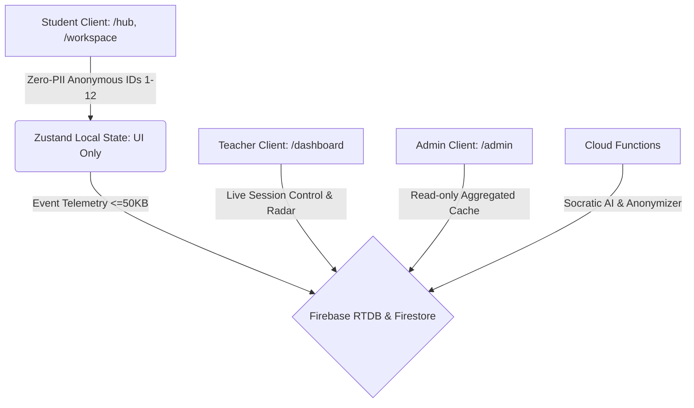

# Master Implementation Plan — MathmatiCore (PRD v6.4)

תוכנית מימוש הנדסית כוללת לפלטפורמת הלמידה ההיברידית **MathmatiCore (מתמטיקאור)** בהתאמה מחייבת ל-**PRD Version 6.4 (19 באוגוסט 2026)**.

---

## 1. ארכיטקטורת המערכת ומקורות האמת



* **שכבת תצוגה ומצב מקומי:** Zustand (`useWorkspaceStore`, `useAuthStore`, `useStore`, `useAdminStore`, `useChatStore`) — משמשת לתצוגה ולזמן ריצה מקומי בלבד.
* **שכבת אגירה באופליין:** IndexedDB בתור FIFO קשיח (עד 500 אירועים) — חל איסור מוחלט על LocalStorage לתורי טלמטריה.
* **מקור האמת הסמכותי:** Firebase Realtime Database & Firestore — כל המעברים, הזמנים, הציונים והסטטוסים נקבעים ונאכפים בשרת.

---

## 2. מוקדי תיקון מיידיים (P0)

### 2.1 מודול 22: ערוץ שיח וצ'אט תלמיד-מורה (Teacher-Student Chat Engine)
> [!IMPORTANT]
> הודעות שנשלחו מתלמיד נחסמו ב-Firebase RTDB (`PERMISSION_DENIED`) עקב חוקי אבטחה שדרשו זיהוי Cloud Function שלא הופק בהתחברות אנונימית.

* **קובץ לשינוי:** [`database.rules.json`](file:///c:/Users/david/Projects/MathmatiCore/database.rules.json)
  * מתן הרשאת כתיבה וקריאה לחדר הצ'אט הספציפי `chat_messages/$roomId` עבור כל משתמש מחובר (`auth != null`), כאשר המורה והאדמין מורשים לקרוא את כל החדרים.
* **קובץ לשינוי:** [`useChatStore.ts`](file:///c:/Users/david/Projects/MathmatiCore/react-ts-version/src/application/useChatStore.ts)
  * הבטחת סנכרון דו-כיווני מיידי ואופטימיסטי, והאזנה לחידוש חיבור בעת התחברות משתמש.

### 2.2 מודולים 1 & 6: זיהוי תלמיד ותצוגת פרופיל (Zero-PII Student Identity)
> [!IMPORTANT]
> בסרגל העליון במרחב העבודה של התלמיד לא מופיע זיהוי ברור של מספר התלמיד, מה שמקשה על מעקב ובדיקות.

* **קובץ לשינוי:** [`WorkspaceTopbar.tsx`](file:///c:/Users/david/Projects/MathmatiCore/react-ts-version/src/features/workspace/WorkspaceTopbar.tsx)
  * הוספת תג זיהוי מעוצב ובולט לצד הלוגו: `🎓 תלמיד {X} | כיתת פיילוט` (ללא PII, מזהים 1–12 בלבד).
* **קובץ לשינוי:** [`StudentHub.tsx`](file:///c:/Users/david/Projects/MathmatiCore/react-ts-version/src/presentation/pages/StudentHub.tsx)
  * הדגשת מספר התלמיד בכותרת הלובי.

### 2.3 מודולים 1 & 2: מנגנון התנתקות ויציאה מהמערכת (Student Clean Logout)
> [!IMPORTANT]
> לחיצה על "יציאה" בממשק התלמיד מחזירה את התלמיד אוטומטית ללובי במקום להשאירו במסך ההתחברות.

* **קובץ לשינוי:** [`useAuthStore.ts`](file:///c:/Users/david/Projects/MathmatiCore/react-ts-version/src/application/useAuthStore.ts)
  * איפוס סינכרוני מוחלט של `user: null`, `role: null`, `isAuthenticated: false` ומחיקת כל מפתחות ה-Storage ב-`unifiedLogout()`.
* **קובץ לשינוי:** [`App.tsx`](file:///c:/Users/david/Projects/MathmatiCore/react-ts-version/src/App.tsx)
  * וידוא ש-`RoleRouter` אינו מנתב ל-`/hub` כאשר `isAuthenticated === false`.

---

## 3. מיפוי 29 המודולים של PRD v6.4

### חטיבה א': הזדהות, ניתוב ואבטחה (מודולים 1–5, 27)
1. **מודול 1 (הזדהות סדרתית):** בחירת מזהה 1–12, סיסמה `10203040`, רטט 300ms בשגיאה, ללא דיאלוגים חוסמים.
2. **מודול 2 (מיתוג תפקידים ושומרי נתיב):** Single Source of Truth ב-Zustand, ניתוב ללובי במקרה כשל תוך ≤50ms.
3. **מודול 3 (סינון PII):** חסימת קלט בזמן אמת ב-Regex, אפס זליגת שמות/טלפונים/ת"ז.
4. **מודול 4 (סכמות בסיס נתונים):** הפרדה קשיחה בין `classes`, `students`, `sessions`, `workspace_states`.
5. **מודול 5 (חוזי טלמטריה):** 13 סוגי אירועים מוקלדים במדויק ב-`TelemetryDetailsMap`, גודל מטען ≤50KB, שדה `column_index` חובה באירועים מוגבלי-טור.
6. **מודול 27 (חוקי אבטחה גלובליים):** דחייה אטומית 403 לכל חריגה מסכמה, מפתחות מוגנים ב-Secret Manager.

### חטיבה ב': מרחב הלמידה הדיגיטלי VRA (מודולים 6–13)
7. **מודול 6 (לובי התלמיד):** הצגת המפגש הפעיל בלבד שנמשך משידור המורה, Snapshot listener ממוקד.
8. **מודול 7 (לוח בית המספרים):** עמעום טורים לא פעילים (`brightness: 0.6`), בידוד pointer-events.
9. **מודול 8 (לבני דינס וקנבס):** 60fps ב-HTML5 Canvas/WebGL, הצמדה מגנטית (Magnetic Snap), אירועי Undo אינם נספרים כשגיאות.
10. **מודול 9 (מקלדת דינמית וגשר VRA):** נעילת מקלדת בטורים הדורשים המרה עד להשלמת הפעולה הפיזית בלבנים.
11. **מודול 10 (לוח חיבור סימטרי):** חקירה עצמאית 0–30 שנ', Fade-In של רשת תמיכה ב-30 שנ' היסוס.
12. **מודול 11 (כפתור Undo פדגוגי):** כפתור בגודל 48x48px, מחסנית מקומית עד 10 פעולות אחרונות, שחזור snapshot דטרמיניסטי.
13. **מודול 12 (בלימת ניחושים וחיכוך פדגוגי):** טריגר 45 שנ' היסוס או 4 שגיאות רצופות, מגירת חניכה נשלפת, נעילת כרטיס ל-**30 שניות בדיוק** (v6.4) בעת בחירת מסיח שגוי.
14. **מודול 13 (חונך סוקרטי ב-AI):** חוזה `GeminiSocraticRequest/Response`, איסור חשיפת תשובה סופית, רמזים סטטיים ב-fallback.

### חטיבה ג': פדגוגיה, מפגשים ושער אישור (מודולים 14–16, 20)
15. **מודול 14 (מפגשים 1–8 ומנוע תרגילים):** 7 תרגילי חובה, 15 דקות עבודה (מפגשים 3–7) ו-25 דקות (מפגשים 2 ו-8), פיצול לנתיב ביסוס או אתגר בסיום.
16. **מודול 15 (ארגז חול ומצב מקרן):** מסך המתנה אטום ("הקשיבו להסבר המורה על גבי המקרן"), שחרור תוך ≤1,000ms.
17. **מודול 16 (לוח רפלקציה תלת-שלבי SRL):** מדד התמדה: $Persistence = \frac{U}{U+E+G} \times 100$, ברירת מחדל 100% אם המכנה 0.
18. **מודול 20 (שער אישור מורה קשיח):** בסיום מפגש 2 (`is_completed == true`), חסימת מעבר למפגש 3 ומסך "מעוף הדבורה", שחרור בדשבורד המורה תוך ≤1,000ms. חישוב `matrix_recommended_path` בטריגר עצמאי (50% קו חלוקה).

### חטיבה ד': ניהול מורה, רדאר ואנליטיקה (מודולים 17–19, 21–23)
19. **מודול 17 (מצב לא מקוון ותור FIFO):** אגירה ב-IndexedDB עד 500 אירועים, פרוטוקול התאוששות בן 5 שלבים.
20. **מודול 18 (רדאר פדגוגי שקט):** גריד קבוע 3×4 ל-12 תלמידים אנונימיים, קדימות צבעים: $\text{RED} > \text{GREY} > \text{YELLOW} > \text{GREEN}$.
21. **מודול 19 (הקצאת התאמות שקטות):** החלת פרופיל תמיכה בגבול תרגיל בטוח בלבד, ללא שום חיווי ויזואלי לתלמיד.
22. **מודול 21 (מסך מפוצל לאבחון מורה):** צד שמאל: סרטון שחזור קנבס מקומי (ללא אודיו/מצלמה). צד ימין: טבלת ציר החלטות קוגניטיבי (VRA Timeline).
23. **מודול 22 (ערוץ שיח מורה-אדמין):** תקשורת טקסט בלבד (ללא STT), אנונימיזציה דו-שכבתית ב-Regex ו-Cloud Functions.
24. **מודול 23 (דוחות פדגוגיים ו-PDF):** מחולל PDF ב-Cloud Functions, המלצות מבוססות ציון (<50% קבוצה קטנה, 50-75% שיח עמיתים, >75% אתגר).

### חטיבה ה': ניהול אדמין ומכונת מצבים (מודולים 24–26, 28–29)
25. **מודול 24 (סקירת מערכת כוללת):** אגרגציה מתוזמנת אחת לשעה למסמך `store_cache`, חסימת קריאת טלמטריה פרטנית לאדמין.
26. **מודול 25 (אשף הקמת כיתה):** הגבלת כיתת "המבקרים" ל-12 תלמידים בלבד, מזהים 1–12, סיסמה קבועה `10203040`.
27. **מודול 26 (קטלוג תוכנית לימודים):** הפצת שינויים ב-Batch Write לתרגילים שטרם החלו בלבד.
28. **מודול 28 (מרכז תמיכה ניהולי):** לוח פניות מסונן מ-PII, מחוון שקט בסרגל הניהול.
29. **מודול 29 (ניהול מצב ומכונת מצבים):** חנויות Zustand מופרדות, מכונת מצבים: `IDLE` → `PROBLEM_ACTIVE` → `REGROUPING_ACTIVE` → `SOCRATIC_ACTIVE` → `COMPLETE`.

---

## 4. תוכנית בדיקה ואימות הנדסית (Verification Plan)

### 4.1 בדיקות אוטומטיות (Automated Test Suite)
```powershell
cd react-ts-version
npm test
npm run build
```
* אימות מעבר 100% של 458 בדיקות Vitest.
* אימות קומפילציה נקייה עם אפס שגיאות TypeScript/Vite.

### 4.2 בדיקות שטח בלייב (Live End-to-End Verification)
1. **צ'אט (מודול 22):** שליחת הודעה מתלמיד 1 -> וידוא הגעה בזמן אמת לדשבורד המורה -> שליחת מענה מהמורה ווידוא קבלתו אצל התלמיד.
2. **זיהוי תלמיד (מודולים 1 & 6):** וידוא הצגת תג "תלמיד 1" בסרגל העליון בכל המסכים.
3. **יציאה נקייה (מודולים 1 & 2):** לחיצה על "יציאה" בממשק התלמיד מחזירה ישירות למסך ההתחברות ומאפשרת מעבר לתלמיד 2.
4. **CI/CD Deployment:** ביצוע `git push` ואימות סיום מוצלח של ה-Workflow ב-GitHub Actions ופריסה ל-[mathimaticore.web.app](https://mathimaticore.web.app).
